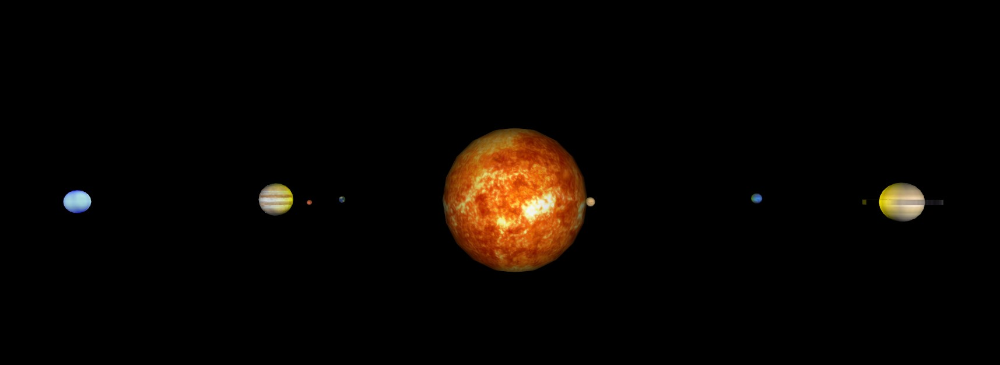
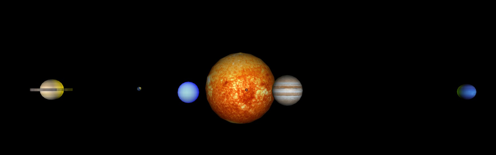
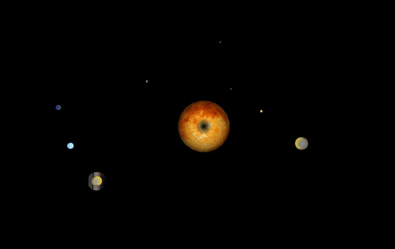

# Solar System

## About project
The project presents an interactive visualization of the Solar System in **X3D language**. The goal was to create a realistic model of the planets along with their rotation around their axes and the Sun. In addition, different viewpoints were used, allowing to observe the scene from different perspectives.

## Technologies
- The model was implemented in **X3D 3.3**, which allows rendering three-dimensional scenes in the browser.
- For visualization, **Octaga software** was used to display and interact with 3D objects.
- The textures of the planets are derived from actual surface maps, adding to the realism of the design.

## Implementation
Each planet was defined as a separate Transform node, containing the corresponding textures and animations. The rotation of the planets and the Sun was implemented using **OrientationInterpolator** and **TimeSensor** nodes, which simulate rotation cycles. Saturn has an additional element - a ring, created using the Cylinder model.

## Results
**Front view**

**Top view**

